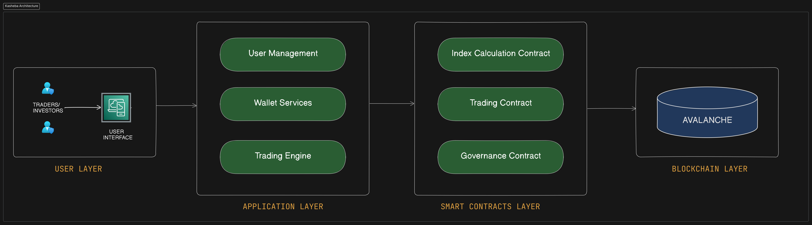

# Introduction to Trading City Indexes on Kasheba

**Kasheba: A New Horizon in Real Estate Speculation**

Kasheba is poised to revolutionize the way we engage with real estate markets. By leveraging the power of blockchain technology, Kasheba introduces a decentralized platform that enables users to speculate on the price movements of real estate markets across the globe through tradable city indexes. This innovative approach allows participants to gain exposure to the real estate market without the need for significant investment in physical properties.

**The City Index: A Gateway to Global Markets**

A city index on Kasheba represents a composite value derived from various real estate metrics within a specific urban region. These metrics include, but are not limited to, property prices, rental yields, and demographic trends. By tokenizing these indexes, Kasheba offers a unique instrument that encapsulates the economic health and potential of the real estate market in major metropolitan areas like New York, Paris, Tokyo, and beyond.

**Speculation and Trading: The Heart of Kasheba**

At its core, Kasheba is not just a reflection of the real estate market but a vibrant ecosystem for speculation and trading. Participants can buy, sell, or hold city index tokens, speculating on the future performance of these markets. The platform's design facilitates a dynamic trading environment where real-world data influences token value, and market sentiment drives investment strategies.

# Core Mechanics of City Index Trading on Kasheba
Trading on Kasheba is designed to be intuitive for those familiar with financial markets, yet accessible enough for new entrants. Here’s how it works:

1. **Market Access**: Users gain access to the platform and can view a list of available city index tokens.
2. **Order Placement**: Traders place orders to buy or sell city index tokens. Orders can be market orders, executed at the best available price, or limit orders, executed at a specified price.
3. **Order Book**: An order book records all open orders. It's continuously updated as new orders are placed and old ones are filled or canceled.
4. **Trade Execution**: When a buy order matches a sell order, the trade is executed. The Kasheba platform handles the settlement of trades on-chain, ensuring transparency and immutability.
5. **Portfolio Management**: Users can manage their holdings, track the performance of their investments, and make decisions based on market movements and personal speculation.
**Speculative Dynamics**

The speculative element of Kasheba comes from participants’ predictions about future real estate market performance. Traders may consider various factors, including economic indicators, property market trends, or global events, to make informed decisions about the potential rise or fall of a city index token’s value.

**Liquidity and Market Making**

To ensure a fluid market, Kasheba incorporates mechanisms for liquidity provision. This includes the possibility of liquidity pools where users can stake their tokens, earning rewards, and providing the necessary liquidity for smooth market functioning.

**Blockchain Settlement**

The use of the Avalanche blockchain for trade settlement provides the Kasheba platform with a fast, secure, and transparent transaction ledger. This decentralized infrastructure ensures that all trades are immutable and verifiable by all participants.

**Chainlink Oracles**

Real-time price data is critical for the speculative trading of city index tokens. Chainlink’s decentralized oracle network is integrated.

# System Architecture 

## Data Sources and Reliability
The Kasheba platform aggregates data from a variety of reputable sources, including:

- Governmental housing statistics and records
- Official economic reports and indicators
- Established real estate market analysis firms
- Direct feeds from property listing and rental platforms
The data collected from these sources undergoes rigorous validation and cross-referencing to prevent inaccuracies and manipulation.

## Interpreting Market Indicators
- **Price Trends**: Charts and graphs depicting the historical and current trends in property prices and rental rates.
- **Economic Indicators**: Updates on relevant economic factors such as inflation rates, employment statistics, and interest rate changes.
- **Demographic Information**: Insights into population growth, migration patterns, and urban development plans.
Traders use these indicators to gauge market sentiment and make predictions about future index performance.

## Use of Technical and Fundamental Analysis in Speculation
This involves studying statistical trends gathered from trading activity, such as price movement and volume. Technical analysts on the Kasheba platform might use:

- **Chart Patterns**: To identify trends and predict future market movements.
- **Technical Indicators**: Such as moving averages and Relative Strength Index (RSI) to identify potential entry and exit points.
- **Market Volume**: To assess the strength or weakness of a market trend.
### Fundamental Analysis
This method assesses a city's real estate market value by examining economic, financial, and other qualitative and quantitative factors. Fundamental analysts may focus on:

- **Macroeconomic Factors**: Such as economic cycles, policy changes, or international trade agreements.
- **Industry Health**: Evaluating the overall health of the real estate industry in the city.
- **Market News and Events**: Keeping abreast of news that could impact the real estate market, such as changes in housing laws or major commercial developments.
By leveraging these analytical methods, traders can form a more comprehensive understanding of market dynamics, which can lead to more informed and strategic trading decisions on the Kasheba platform.

# Platform Features and Technology
- **Token Minting**: Smart contracts handle the creation of city index tokens based on real-time market data.
- **Automated Settlement**: Trades are settled instantly on the blockchain, with smart contracts ensuring accuracy and fairness.
- **Decentralized Governance**: Token holders can participate in decision-making processes through smart contract-enabled voting mechanisms.
## Integration with Chainlink Oracles
To provide accurate and real-time price feeds for city indexes, the Kasheba platform integrates with Chainlink's decentralized oracle network. This ensures that external data used for index calculations is reliable and securely delivered to the blockchain.

### Benefits of Chainlink Integration
- **Data Integrity**: Chainlink oracles provide high-quality data from multiple sources, mitigating the risk of data manipulation.
- **Decentralized Infrastructure**: The decentralized nature of oracles prevents single points of failure, enhancing the platform's resilience.
- **Timely Updates**: Real estate market data is updated regularly, ensuring that token prices reflect the latest market conditions.
## Security Measures
- **Cryptography**: State-of-the-art encryption methods safeguard sensitive data and transactions.
- **Wallet Security**: Integration with secure and reputable wallet providers ensures the safekeeping of digital assets.
- **Regular Audits**: The platform's smart contracts and security systems undergo regular audits by independent third parties.
### Risk Management Features
- **Risk Disclosure**: Comprehensive information on the risks involved in trading city index tokens is provided to all users.
- **Risk Limits**: Users have the ability to set their own risk limits, controlling the maximum amount they are willing to risk on trades.
- **Market Surveillance**: The platform employs advanced monitoring systems to detect and prevent market manipulation or other unfair trading practices.
## Fee Structure and Incentives
A transparent fee structure is critical for maintaining the Kasheba platform's economic balance, while incentives are used to encourage beneficial behaviors within the ecosystem.

### Transaction Fees
- **Trading Fees**: A small fee is charged on trades, contributing to the operational costs of the platform and reward pools.
- **Withdrawal Fees**: Fees may apply to token withdrawals, ensuring the security and efficiency of the process.
### Core API Functions
- **Account Management**: Endpoints for user registration, authentication, and account settings.
- **Market Data**: Access to real-time and historical market data for city index tokens.
- **Trading Operations**: Functions to place, manage, and cancel buy/sell orders.
- **Wallet Services**: Integration points for wallet creation, balance checks, and transaction history.
## Planned Upgrades and Features
- **User Interface Enhancements**: Streamlining the trading experience with improved navigation, personalized dashboards, and advanced market analytics.
- **Smart Contract Optimization**: Refining smart contract logic for increased efficiency and reduced transaction costs.
- **Cross-Chain Integration**: Enabling the trading of city index tokens across multiple blockchain networks to improve liquidity and user access.
- **Mobile Application**: Developing a mobile app to provide users with on-the-go access to trading and account management.
- **Global Expansion**: Adding more city index tokens from cities around the world, including emerging markets.
- **Virtual Real Estate Markets**: Extending the platform to include virtual real estate assets from blockchain-based virtual worlds.

